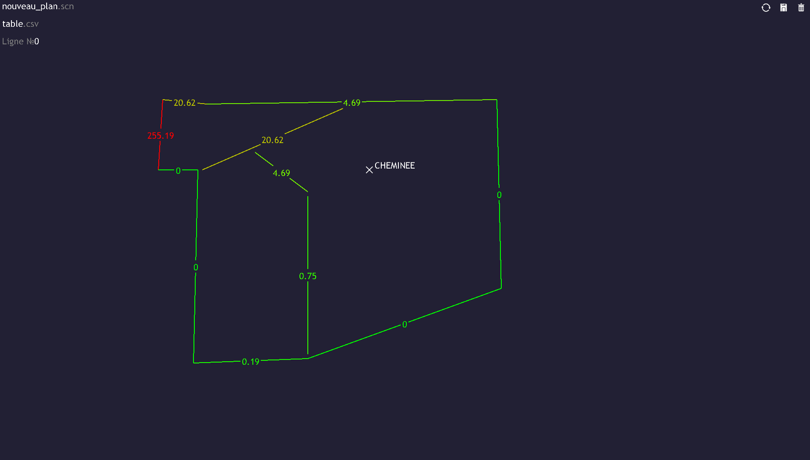

# ElectrodeViewer
 A very old prototype of a graphic interface built for electrode inputs.
 This build may suffer from 'z' fighting on some computer and has no use outside of its purposed hardware.

 